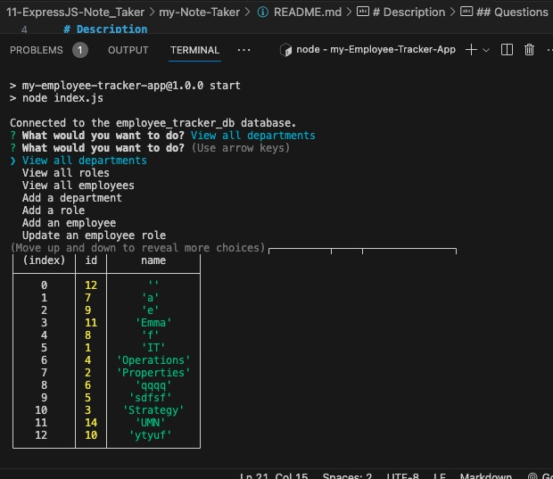

  # my-Employee-Tracker-App
  A command-line application from scratch to manage a company's employee database, using Node.js, Inquirer, and MySQL.

  # Description
  AS A business owner
  I WANT to be able to view and manage the departments, roles, and employees in my company
  SO THAT I can organize and plan my business 

  ## Table of Contents

  [Description](#description) | [License](#license) | [Questions](#questions)
  
  

  ## License
  
  License: MIT

  
  
  ## Questions

  Demo video: https://drive.google.com/file/d/1hIgwCoxUtf4XVm3kczoY2Tf4CvCWSADE/view
  
  GitHub username: mbrown50

  GitHub Repo: https://github.com/mbrown50/my-Employee-Tracker-App
